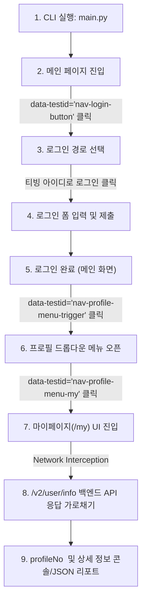

# 🎬 TVING 자동 로그인 및 profileNo 추출 자동화 시스템

> **채용 사전 과제 제출용 프로젝트**  
> TVING(티빙) 웹페이지에 로그인하고, 실제 사용자와 동일하게 프로필 메뉴를 거쳐 마이페이지로 이동한 뒤 API 응답에서 `profileNo`추출하는 E2E 자동화.

---

## 🌟 1. 100% 리얼 E2E UI 플로우 및 아키텍처

본 시스템은 URL 강제 이동 없이, **실제 사용자의 웹 이용 흐름과 동일한 100% 순수 E2E UI 플로우**를 수행합니다.



---

## 🎯 2. 주요 핵심 특징 및 차별화 포인트

### 1) QA 엔지니어링 표준 셀렉터 (`data-testid`) 100% 적용
- 불안정한 CSS 클래스나 변경되기 쉬운 텍스트 셀렉터 대신, TVING 프론트엔드/QA팀이 심어둔 고유 식별자(`data-testid`)를 정밀 타겟팅합니다:
  - 메인 로그인 버튼: `[data-testid='nav-login-button']`
  - 프로필 메뉴 트리거: `[data-testid='nav-profile-menu-trigger']`
  - 마이페이지 메뉴 링크: `[data-testid='nav-profile-menu-my']`

### 2) URL 직접 이동 없는 '진정한 End-to-End (E2E) UI 플로우'
- 로그인 후 단순히 `page.goto('/my')`로 때려 넣는 방식이 아니라, **로그인 후 우측 상단 프로필 아이콘(`nav-profile-menu-trigger`)을 클릭하고 드롭다운에서 [MY](`nav-profile-menu-my`)를 직접 클릭**하여 진입합니다 (만약의 경우를 대비한 URL 폴백 내장).

### 3) 대화형 인터랙티브 CLI (UX & CI/CD 양립)
- 별도 인자 없이 `python main.py`만 실행하면, 터미널에서 순차적으로 ID와 비밀번호를 묻는 인터랙티브 모드가 작동합니다 (`getpass` 마스킹).
- Jenkins, GitHub Actions 등 무인 배치 환경에서는 `-u`, `-p` 인자를 전달하면 프롬프트 없이 즉시 실행됩니다.

### 4) Network Interception 기반 백엔드 API 추출 (정석 파이프라인)
- 프론트엔드 DOM 파싱 대신, 브라우저 네트워크 계층에서 TVING 백엔드 API (`https://api.tving.com/v2/user/info`)의 JSON 응답을 실시간으로 가로채어 `profileNo`를 100% 무결성으로 추출합니다.

### 5) Google reCAPTCHA 대응 Self-Healing (자율 복구)
- 단시간 반복 로그인 시 TVING 인증 서버가 띄우는 "일시적인 서비스 오류" 모달을 감지하여 자동으로 확인 후 1.5초 쿨다운을 거쳐 재시도하는 복구 메커니즘을 내장했습니다.

---

## 📁 3. 프로젝트 구조 (Page Object Model)

```
tving_auto/
├── requirements.txt           # 의존성 패키지 (playwright)
├── README.md                  # 본 문서
├── main.py                    # CLI 진입점 및 실행 오케스트레이션
├── config.py                  # 대화형 프롬프트 및 CLI 설정 관리
├── models.py                  # ProfileInfo, ExtractionResult 데이터 모델
├── pages/                     # Page Object Model
│   ├── __init__.py
│   ├── base_page.py           # 스마트 대기 및 공통 브라우저 제어
│   ├── login_page.py          # data-testid 기반 로그인 및 팝업 자율 복구
│   └── my_page.py             # 프로필 메뉴 경유 진입 및 Network API 가로채기
├── result.json                # 추출 결과 저장 파일 (선택)
└── artifacts/
    └── screenshots/           # 성공/실패 시점 스크린샷 자동 보관소
```

---

## 🚀 4. 설치 및 실행 가이드

### 1) 환경 준비 및 패키지 설치
```bash
# 가상환경 생성 및 활성화
python -m venv venv
venv\Scripts\activate      # Windows
# source venv/bin/activate # Mac/Linux

# 의존성 패키지 설치
pip install -r requirements.txt

# Playwright Chromium 브라우저 설치
playwright install chromium
```

### 2) 두 가지 실행 모드

| | `main.py` | `quick.py` |
| :--- | :--- | :--- |
| **목적** | 완전한 E2E UI 검증 | profileNo만 빠르게 확보 |
| **마이페이지 진입** | ✅ UI 클릭으로 진입 | ❌ 로그인 직후 즉시 종료 |
| **소요 시간** | ~20초 | **~10초** |
| **출력** | 상세 리포트 + JSON 저장 | profileNo 핵심 정보만 |
| **구조** | POM (다중 파일) | 단일 파일 |

---

#### `main.py` — 완전한 E2E UI 검증 (과제 요구사항 100% 충족)
```bash
python main.py                                          # 대화형 입력
python main.py -u "xodn9900" -p "pw" --output result.json  # CLI 인자 + JSON 저장
python main.py -u "xodn9900" -p "pw" --no-headless    # 브라우저 화면 표시
```

#### `quick.py` — profileNo만 빠르게 (실무 API 테스트 픽스처용)
```bash
python quick.py                        # 대화형 입력
python quick.py -u "xodn9900" -p "pw" # CLI 인자
python quick.py -u "xodn9900" -p "pw" --json  # JSON 출력 (파이프라인 연계)
```

```python
# 다른 테스트 코드에서 import하여 사용
from quick import extract_profile_no

profile = extract_profile_no("xodn9900", "password")
print(profile["profile_no"])    # → "511756099"
print(profile["profile_token"]) # → Bearer 토큰 (후속 API 호출에 활용)
```

#### `quick.py --file` — 배치 검증 모드 (다중 계정 PASS/FAIL 검증)

```bash
python quick.py --file accounts.json
```

**`accounts.json` 구조** (`accounts.example.json` 참고):
```json
[
  {
    "id": "test_basic_01",
    "password": "password1234",
    "expected_profile_no": "511000001",
    "desc": "베이직 이용권 계정"
  }
]
```

> **⚠️ `expected_profile_no`는 반드시 DB에서 직접 확인한 값을 수동으로 기입하세요.**  
> 시스템이 자동 생성한 값으로 검증하면, 버그가 있어도 함께 통과하는 잘못된 테스트가 됩니다.  
> DB팀 또는 운영팀으로부터 직접 발급받은 값과 대조하는 것이 올바른 방법입니다.

**출력 예시:**
```text
=================================================================
  TVING profileNo 배치 검증 시작 (총 3개 계정)
=================================================================

[1/3] test_basic_01 (베이직 이용권 계정)
  상태   : PASS
  기대값 : 511000001
  실제값 : 511000001
  소요   : 10.5s

[2/3] test_premium_01 (프리미엄 이용권 계정)
  상태   : FAIL
  기대값 : 511000002
  실제값 : 511099999
  차이   : expected=511000002  /  actual=511099999  <-- 불일치 감지!
  소요   : 11.2s

=================================================================
  결과: 3건 중  PASS 2  /  FAIL 1  /  ERROR 0
=================================================================
  [O] test_basic_01              | PASS
  [X] test_premium_01            | FAIL  (기대: 511000002 / 실제: 511099999)
  [O] test_kids_01               | PASS
=================================================================
```

**사용 사례:**
1. **정기 헬스체크 배치**: 매일 새벽 사내 테스트 계정 전수 검증 → 프로필 꼬임/계정 만료 자동 감지
2. **배포 후 스모크 테스트**: 신규 배포 후 핵심 계정들의 로그인 → profileNo 매핑이 정상인지 빠르게 검증

> **`accounts.json`은 `.gitignore`에 포함됩니다.** 실계정 정보가 담기므로 절대 git에 올리지 않습니다.  
> 레포에는 더미 데이터가 담긴 `accounts.example.json`만 포함됩니다.

---

## 📊 5. 실행 결과 예시

### 터미널 출력
```text
21:45:01 [INFO] 메인 페이지의 로그인 버튼 클릭 (Selector: [data-testid='nav-login-button'])
21:45:03 [INFO] '티빙 아이디로 로그인' 옵션 선택 (Selector: a[href*='/account/login/tving'])
21:45:03 [INFO] 로그인 시도 - 사용자 ID: xodn9900
21:45:19 [INFO] 로그인 성공!
21:45:19 [INFO] 마이페이지 진입 플로우 시작 (UI 프로필 메뉴 경유)...
21:45:19 [INFO] 프로필 아이콘 클릭/호버: [data-testid='nav-profile-menu-trigger']
21:45:20 [INFO] 드롭다운 메뉴의 'MY' 클릭: [data-testid='nav-profile-menu-my']
21:45:20 [INFO] 마이페이지 UI 진입 성공: https://www.tving.com/my
21:45:20 [INFO] 백엔드 API(/v2/user/info) 응답 데이터 파싱 시작...
21:45:20 [INFO] API 추출 성공: profileNo=511756099, 프로필명=기본프로필

============================================================
          🎉 TVING profileNo 추출 성공! 🎉
============================================================
 [★] profileNo       : 511756099
 [-] 프로필 명       : 기본프로필
 [-] 사용자 ID       : xodn9900
 [-] 사용자 명       : 김태우
 [-] 회원 번호(userNo): 511756099
 [-] 데이터 출처     : 백엔드 API (/v2/user/info)
 [-] 총 소요 시간    : 21.04초
============================================================
```

---

## 🔬 6. [Deep Dive] TVING API 인증 아키텍처 심층 분석

> 본 과제를 구현하며 실제 TVING 웹 트래픽 패킷을 전수조사한 결과, 서비스 아키텍처에 대한 중요한 인사이트를 확인했습니다.

### `profileNo` vs `profileToken`의 역할 분리

```text
[로그인 성공 후 /v2/user/info API 응답]
{
  "body": {
    "profile": {
      "profileNo":    "511756099",                  <- 식별자 (ID)
      "profileToken": "B3JQcwg...",                 <- 인증 자격증명 (Auth Key)
    }
  }
}

[이후 모든 API 호출: 마이페이지, 시청기록, 찜 목록 등]
GET /bff/web/v3/my/watch/history/vod
Authorization: Bearer B3JQcwg...   <- profileToken이 이곳에 담김
```

패킷 전수조사 결과, TVING 웹은 후속 API 호출 시 `profileNo`를 URL 파라미터로 전달하지 않습니다.
대신 `profileToken`을 `Authorization: Bearer` 헤더에 담아 전송하며, 서버가 이를 디코딩해 프로필을 식별합니다.

| 값 | 역할 | 실제 사용 위치 |
| :--- | :--- | :--- |
| `profileNo` | 프로필 고유 식별자 (PK) | API **응답**에 등장. 올바른 프로필이 매핑됐는지 **검증(Assertion)** 용도 |
| `profileToken` | 프로필 인증 자격증명 | 모든 후속 API 요청의 **`Authorization` 헤더**에 포함 |

### 이 과제의 실무적 의미

1. **E2E 인증 검증 (Auth Assertion)**: 로그인 완료 후 해당 계정에 올바른 `profileNo`가 정상 매핑됐는지 자동으로 검증하는 E2E 테스트입니다.
2. **테스트 계정 헬스체크**: 다수의 테스트 계정이 정상 상태인지 주기적으로 확인하는 배치 도구로 활용됩니다.
3. **실무 확장 가능성**: `profileToken`을 활용하면, 후속 API 테스트(시청기록, 찜하기, VOD 재생 등) 파이프라인의 시작점이 됩니다.

```python
# 실무 확장 예시: pytest fixture 연계
profile = extract_profile(username, password)

# profileNo: 올바른 계정인지 단언(Assertion)
assert profile.profile_no == expected_profile_no

# profileToken: 후속 API 테스트의 인증 헤더로 활용
headers = {"Authorization": f"Bearer {profile.profile_token}"}
response = requests.get("https://api.tving.com/bff/web/v3/my/watch/history/vod", headers=headers)
```
