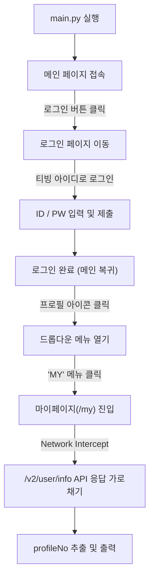

# TVING 자동 로그인 및 profileNo 추출 자동화

TVING 웹페이지에 로그인한 뒤, 실제 사용자처럼 마이페이지로 이동하여 백엔드 API 응답에서 `profileNo`를 추출하는 자동화 프로젝트입니다.

---

## 1. 실행 흐름

실제 사용자의 화면 탐색 흐름과 동일하게 UI를 조작하여 마이페이지에 진입한 뒤 데이터를 추출합니다.



---

## 2. 주요 구현 포인트

### 1) 안정적인 셀렉터 (`data-testid`) 활용
- 화면 변경이나 다국어 처리 시 깨지기 쉬운 텍스트나 클래스명 대신, 개발/QA용으로 심어져 있는 고유 속성(`data-testid`)을 우선 사용했습니다.
  - 메인 로그인 버튼: `[data-testid='nav-login-button']`
  - 프로필 메뉴 트리거: `[data-testid='nav-profile-menu-trigger']`
  - 마이페이지 링크: `[data-testid='nav-profile-menu-my']`

### 2) 실제 사용자 탐색 플로우 반영
- 로그인 후 URL(`tving.com/my`)로 바로 건너뛰지 않고, 우측 상단 프로필 아이콘을 눌러 나타나는 'MY' 메뉴를 직접 클릭해 이동하도록 구성했습니다. (UI 탐색 실패 시 URL 직접 이동으로 자동 대체)

### 3) API 응답(Network Interception)에서 데이터 추출
- 마이페이지 화면의 DOM 텍스트를 파싱하는 방식 대신, 브라우저가 주고받는 네트워크 패킷 중 유저 정보 API(`api.tving.com/v2/user/info`) 응답을 직접 가로채서 `profileNo`를 안전하게 가져옵니다.

### 4) 간헐적 오류 팝업 자동 처리
- 로그인 시 종종 발생하는 "일시적인 서비스 오류" 팝업 감지 시, 자동으로 확인 버튼을 누르고 잠시 대기 후 재시도하도록 예외 처리를 추가했습니다.

---

## 3. 파일 구조

```text
tving_auto/
├── main.py                  # 과제 기본 실행 스크립트 (POM 기반 E2E 플로우)
├── quick.py                 # 단일/배치 빠른 추출 스크립트
├── config.py                # CLI 인자 및 터미널 입력 처리
├── models.py                # 추출 결과 데이터 모델
├── pages/                   # Page Object Model (페이지별 액션 분리)
│   ├── base_page.py         # 브라우저 공통 제어 및 스크린샷 기능
│   ├── login_page.py        # 로그인 화면 제어 및 예외 처리
│   └── my_page.py           # 마이페이지 진입 및 API 가로채기
├── accounts.example.json    # 배치 검증용 샘플 데이터
└── requirements.txt         # 의존성 패키지 (Playwright)
```

---

## 4. 실행 방법

### 1) 패키지 설치
```bash
# 가상환경 생성 및 활성화
python -m venv venv
venv\Scripts\activate      # Windows
# source venv/bin/activate # Mac/Linux

# 필수 패키지 및 브라우저 설치
pip install -r requirements.txt
playwright install chromium
```

### 2) 실행 모드

상황에 맞게 두 가지 스크립트를 제공합니다.

| 구분 | `main.py` (과제 기본) | `quick.py` (빠른 검증) |
| :--- | :--- | :--- |
| **용도** | 전체 E2E UI 탐색 및 검증 | 단일/다중 계정 빠른 profileNo 추출 |
| **마이페이지 진입** | UI 메뉴를 거쳐 직접 이동 | 로그인 직후 API만 포착하여 즉시 종료 |
| **소요 시간** | 약 20초 | 약 10초 |

#### [기본] `main.py` 실행
```bash
# 터미널에서 순차적으로 ID, PW 입력 (비밀번호 마스킹)
python main.py

# CLI 인자로 직접 전달
python main.py -u "아이디" -p "비밀번호"

# 브라우저 화면을 보면서 실행
python main.py -u "아이디" -p "비밀번호" --no-headless

# 결과를 JSON 파일로 저장
python main.py -u "아이디" -p "비밀번호" -o result.json
```

#### [선택] `quick.py` 실행 (빠른 추출 및 배치 검증)
```bash
# 단일 계정 빠른 추출
python quick.py -u "아이디" -p "비밀번호"

# 여러 계정 일괄 비교 검증 (배치 모드)
python quick.py --file accounts.json
```

> **배치 검증 모드 (`--file`)**  
> 사내 테스트 계정 목록(`accounts.json`)을 읽어 순차적으로 로그인하고, 실제 발급된 `profileNo`가 DB 기준 기대값(`expected_profile_no`)과 일치하는지 비교하여 PASS/FAIL 결과를 출력합니다.

---

## 5. 실행 결과 예시

### `main.py` 실행 결과
```text
21:45:01 [INFO] 메인 페이지의 로그인 버튼 클릭 (Selector: [data-testid='nav-login-button'])
21:45:03 [INFO] '티빙 아이디로 로그인' 옵션 선택
21:45:03 [INFO] 로그인 시도 - 사용자 ID: xodn9900
21:45:19 [INFO] 로그인 성공!
21:45:19 [INFO] 마이페이지 진입 플로우 시작 (UI 프로필 메뉴 경유)...
21:45:19 [INFO] 프로필 아이콘 클릭/호버: [data-testid='nav-profile-menu-trigger']
21:45:20 [INFO] 드롭다운 메뉴의 'MY' 클릭: [data-testid='nav-profile-menu-my']
21:45:20 [INFO] 마이페이지 UI 진입 성공: https://www.tving.com/my
21:45:20 [INFO] 백엔드 API(/v2/user/info) 응답 포착 완료

============================================================
          TVING profileNo 추출 결과
============================================================
 [★] profileNo       : 511756099
 [-] 프로필 명       : 딴딴
 [-] 사용자 ID       : xodn9900
 [-] 사용자 명       : 김태우
 [-] 회원 번호(userNo): 511756099
 [-] 데이터 출처     : 백엔드 API (/v2/user/info)
 [-] 총 소요 시간    : 21.04초
============================================================
```

### `quick.py --file` 배치 실행 결과
```text
=================================================================
  TVING profileNo 배치 검증 시작 (총 3개 계정)
=================================================================

[1/3] test_basic_01 (베이직 이용권 계정)
  상태   : PASS
  기대값 : 511000001
  실제값 : 511000001
  소요   : 10.5s

[2/3] test_premium_01 (프리미엄 이용권 계정)
  상태   : FAIL
  기대값 : 511000002
  실제값 : 511099999
  차이   : expected=511000002 / actual=511099999  <-- 불일치 감지
  소요   : 11.2s

=================================================================
  결과: 3건 중 PASS 2 / FAIL 1 / ERROR 0
=================================================================
```

---

## 6. 추가 분석 (네트워크 패킷 분석)

과제를 진행하며 실제 네트워크 요청을 분석해본 결과, 다음과 같은 인증 구조를 확인했습니다:

1. **`profileNo`의 용도**:
   - 웹 화면에서 시청 내역이나 찜 목록 등을 조회할 때, URL 파라미터로 `profileNo`를 직접 보내지 않습니다.
   - `profileNo`는 주로 계정별 프로필 매핑 상태를 검증(Assertion)하거나 유저를 식별하는 Primary Key 역할을 합니다.
2. **실제 API 통신 (`profileToken`)**:
   - 실제 후속 API 호출 시에는 로그인 응답에 함께 포함된 `profileToken`을 `Authorization: Bearer {token}` 형태로 헤더에 담아 통신합니다.
   - 본 프로젝트의 `ProfileInfo` 모델에는 향후 API 테스트 연계를 고려해 `profile_token` 값도 함께 수집할 수 있도록 준비해 두었습니다.
